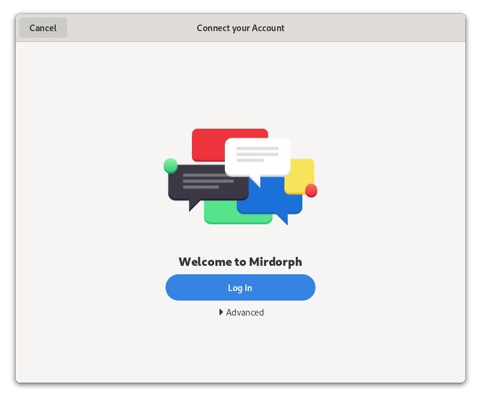
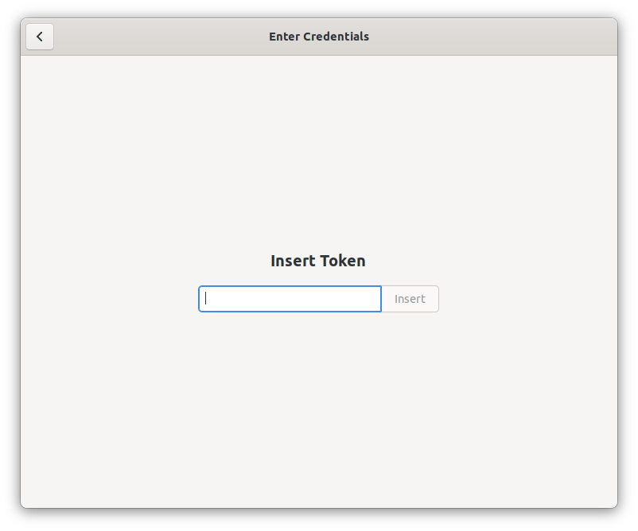
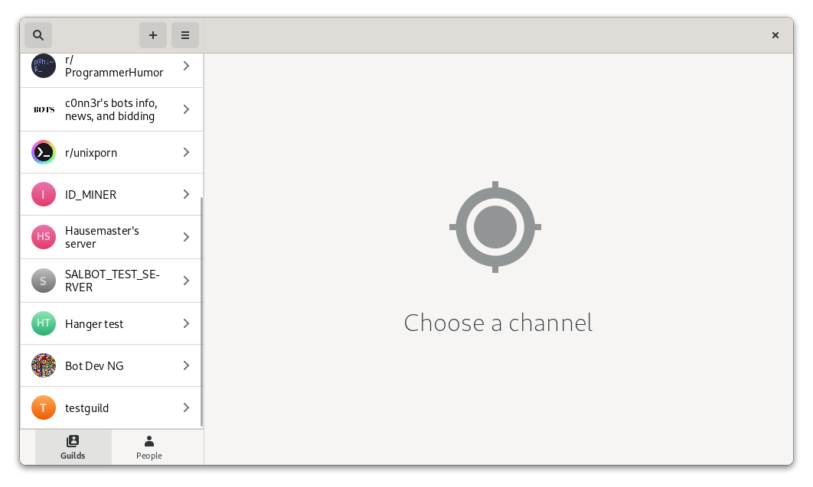
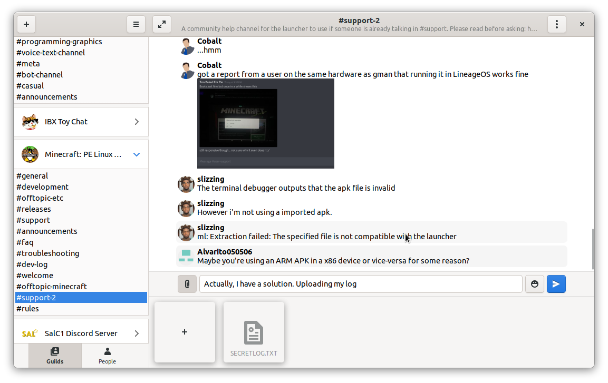
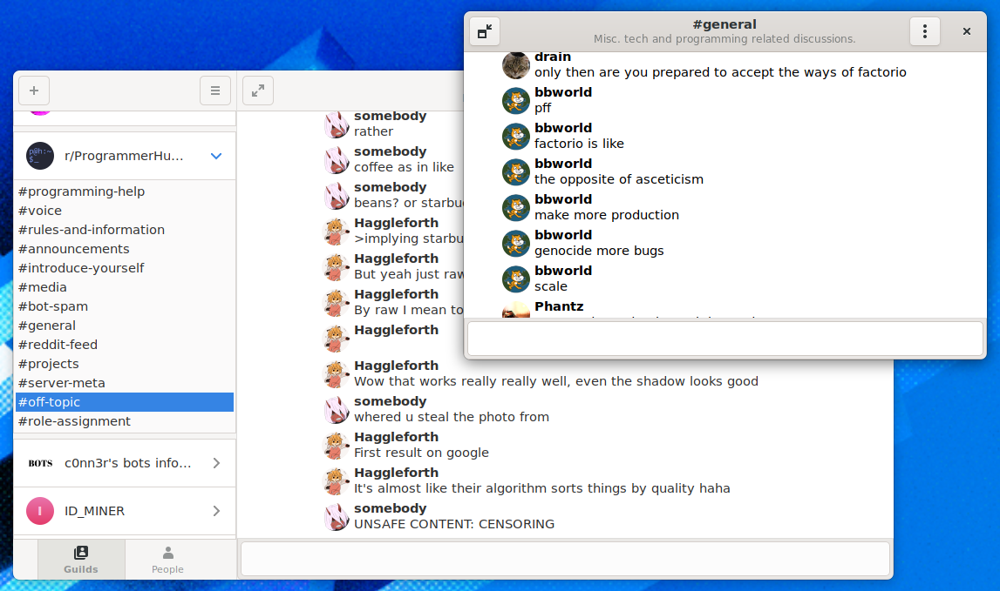
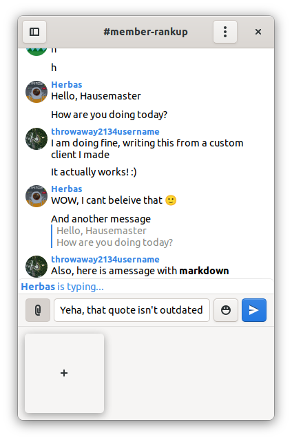
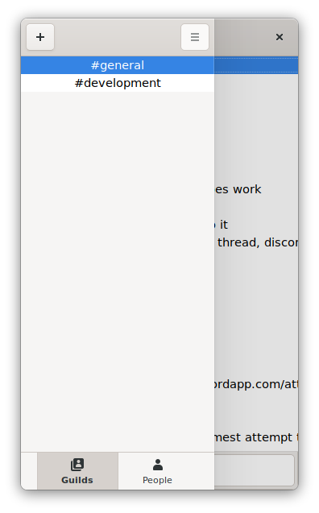

# Mirdorph - a crappy low feature Discord Client

That is it, and it uses discord.py and GTK3.

To run:

Have flatpak and flatpak-builder installed.
Install `org.gnome.Sdk` and `org.gnome.Platform` (v40) if they are not allready installed

And from the source directory:

```bash
# To build and install
flatpak-builder --force-clean --user --install build-dir org.gnome.gitlab.ranchester.Mirdorph.json
# To run
flatpak run org.gnome.gitlab.ranchester.Mirdorph
```

Here are a few screenshots of 0.0.1 (except for one of them):








