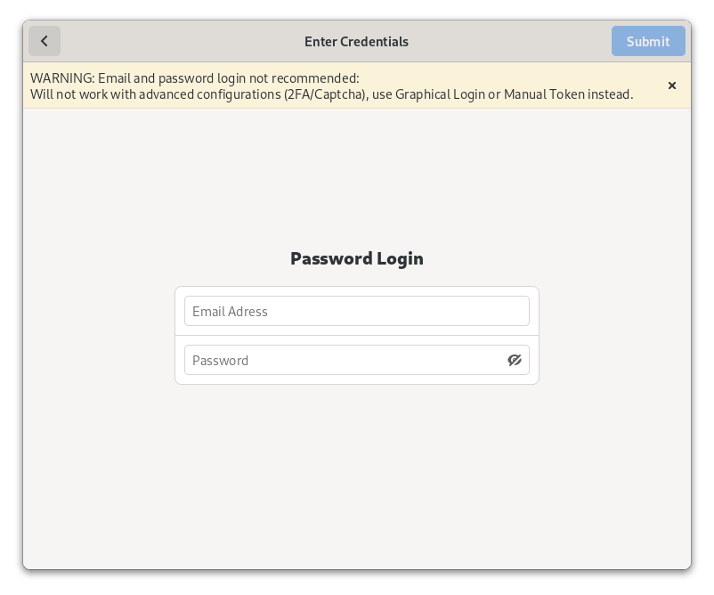
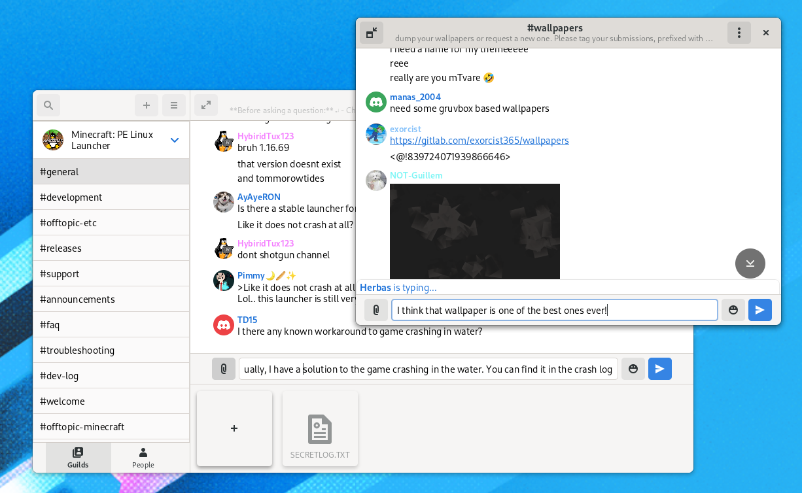
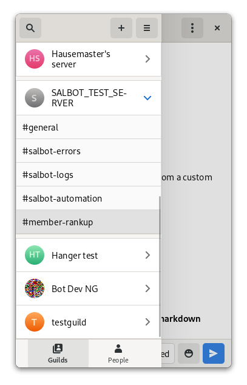
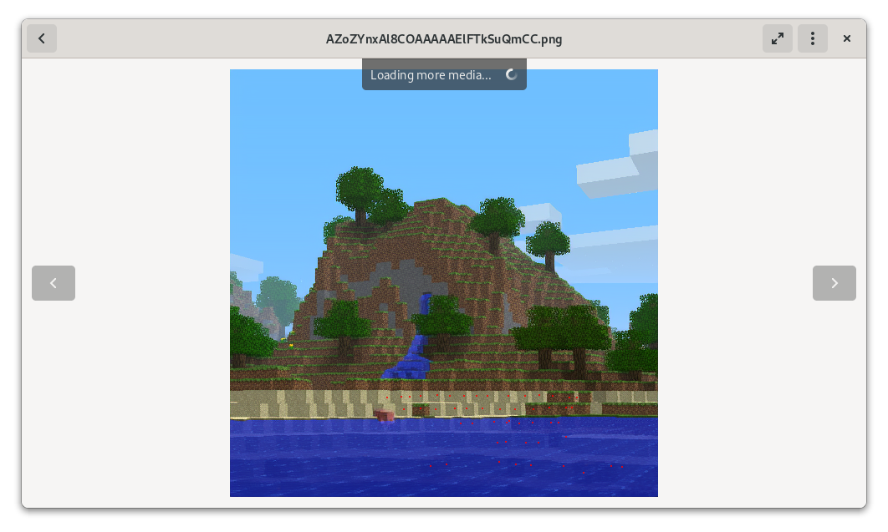
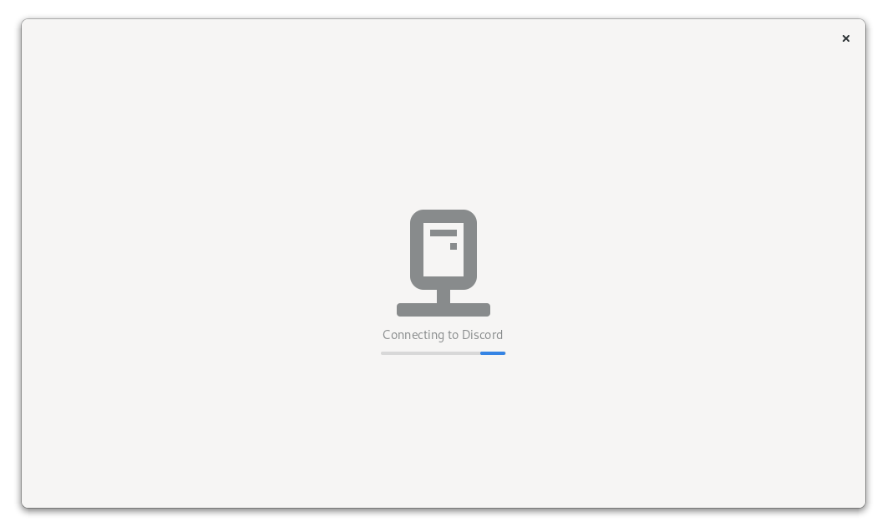

# Mirdorph - a crappy low feature Discord Client

I don't have much else to add.

## To run:

### Download latest snapshot from CI (x86.64 only):

1. Head over to [the *Jobs* page of the repository](https://gitlab.gnome.org/ranchester/mirdorph/-/jobs)
2. Find the latest one with the label *flatpak*
3. Press the download button on the right
4. Extract the zip you downloaded and open a terminal in the resulting directory
5. Install the snapshot with `flatpak --user install mirdorph.flatpak`

### Build from source method:

Have flatpak and flatpak-builder installed.
Install `org.gnome.Sdk`, `org.gnome.Platform` (version master) and `org.freedesktop.Sdk.Extension.rust-stable` if they are
not allready installed.

And from the source directory:

```bash
# To build and install
flatpak-builder --force-clean --user --install build-dir org.gnome.gitlab.ranchester.Mirdorph.json
# To run
flatpak run org.gnome.gitlab.ranchester.Mirdorph
```

## Screenshots

Here are a few screenshots of 0.13.0:












